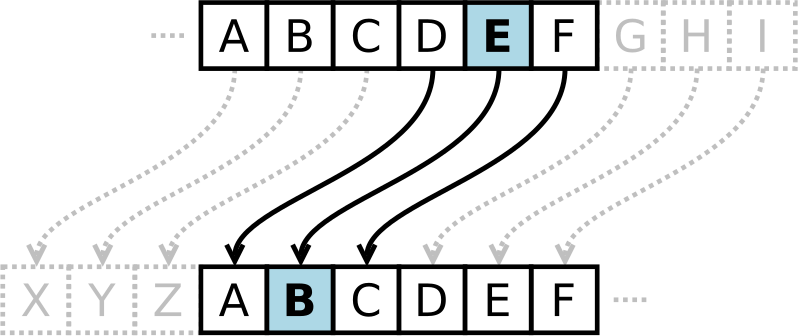
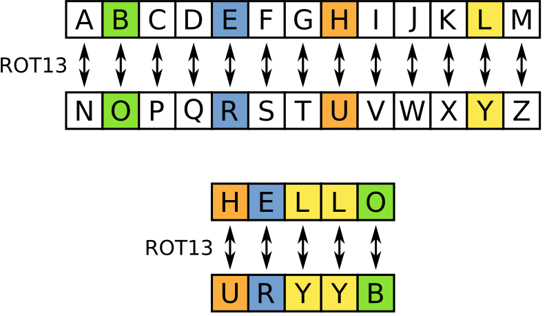

# crypto-webpage

Check your [Hacktoberfest progress](https://hacktoberfest.digitalocean.com/profile)!

## Introduction

We are building a website to learn about building websites and encryption:

<https://video-game-coding-club.github.io/crypto-webpage/>

This website encrypts messages that you give it using the secret key
that you provide and a Caesar cipher. It will also decrypt messages if
you know the secret key for decryption. For a Caesar cipher, the
secret key to decrypt a message is the opposite of the secret key used
to encrypt the message. For example, if the secret key to encrypt the
message was 4, then the secret key to decrypt the message is -4, or
you can use 26 - 4 = 22.

Steps:

1. When you first arrive at the website's homepage, choose the
   language for the homepage prompts.

2. Next enter the message that you would like to encrypt or decrypt,
   in the first box provided.

3. Enter the secret key to encode or decode the message. This must be
   an integer.

4. Finally, click on the "Encrypt" button and the decoded (or encoded)
   message will appear in the last box!

   **10/31/20**: Note that right now the message appears in the result
   alert box.

### Development Status

- [x] Field to enter cleartext:
      [#1](https://github.com/video-game-coding-club/crypto-webpage/issues/1),
      [#13](https://github.com/video-game-coding-club/crypto-webpage/issues/13),
      [#53](https://github.com/video-game-coding-club/crypto-webpage/issues/53)
- [x] Field to enter ciphertext:
      [#1](https://github.com/video-game-coding-club/crypto-webpage/issues/1),
      [#13](https://github.com/video-game-coding-club/crypto-webpage/issues/13),
      [#53](https://github.com/video-game-coding-club/crypto-webpage/issues/53)
- [x] Field to enter secret (the shift):
      [#1](https://github.com/video-game-coding-club/crypto-webpage/issues/1),
      [#14](https://github.com/video-game-coding-club/crypto-webpage/issues/14)
- [x] Function to shift a letter:
      [#55](https://github.com/video-game-coding-club/crypto-webpage/issues/55),
      [#76](https://github.com/video-game-coding-club/crypto-webpage/issues/76),
      [#79](https://github.com/video-game-coding-club/crypto-webpage/issues/79)
- [ ] Function to check that the secret is an integer:
      [#54](https://github.com/video-game-coding-club/crypto-webpage/issues/54)
- [x] Function to shift a text:
      [#70](https://github.com/video-game-coding-club/crypto-webpage/issues/70)

### GitPod Chrome Extension

You might find the GitPod Chrome extension useful

<https://chrome.google.com/webstore/detail/gitpod-dev-environments-i/dodmmooeoklaejobgleioelladacbeki>

## Encryption Methods

### Caesar Cipher

In cryptography, a [Caesar
cipher](https://en.wikipedia.org/wiki/Caesar_cipher), also known as
Caesar's cipher, the shift cipher, Caesar's code or Caesar shift, is
one of the simplest and most widely known encryption techniques. It is
a type of substitution cipher in which each letter in the plaintext is
replaced by a letter some fixed number of positions down the alphabet.
For example, with a left shift of 3, D would be replaced by A, E would
become B, and so on. The method is named after Julius Caesar, who used
it in his private correspondence.

### ROT13

A special case of the Caesar cipher is known as
[ROT13](https://en.wikipedia.org/wiki/ROT13) ("rotate by 13 places",
sometimes hyphenated ROT-13). ROT13 is a simple letter substitution
cipher that replaces a letter with the 13th letter after it.

Because there are 26 letters (2×13) in the basic Latin alphabet, ROT13
is its own inverse; that is, to undo ROT13, the same algorithm is
applied, so the same action can be used for encoding and decoding

